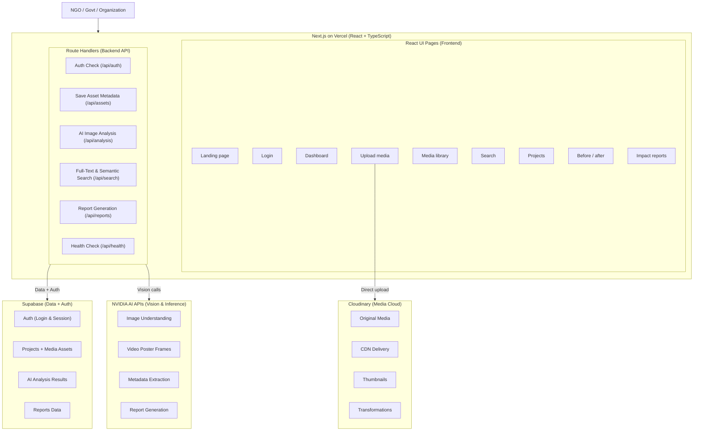

# Product Requirements Document (PRD)
## AI-Powered Sustainability Media Intelligence Platform

---

### 1. Executive Summary & Vision

The **AI-Powered Sustainability Media Intelligence Platform** is a specialized digital asset management and intelligence system built for **NGOs, Government Bodies, and Environmental Organizations**. 

Organizations managing climate action, reforestation, wildlife conservation, waste management, and renewable energy generate thousands of visual media assets (photos, drone footage, field reports, satellite imagery). Today, these assets are trapped in siloed drives with manual tagging, making it difficult to search, verify impact, analyze before-and-after progress, or produce verifiable reports for stakeholders and grantmakers.

This platform bridges that gap by pairing **Next.js Route Handlers**, **Cloudinary**, **Supabase (PostgreSQL & Auth)**, and **NVIDIA AI Vision/LLM APIs** to automatically ingest, analyze, index, and report on visual sustainability media.

---

### 2. System Architecture



---

### 3. User Personas & Core Use Cases

| Persona | Primary Goal | Core Needs |
| :--- | :--- | :--- |
| **Field Officer / Ranger** | Upload field photos & drone captures from remote locations | Direct cloud upload, automated thumbnailing, GPS/timestamp preservation, offline resilience. |
| **Project Manager / NGO Lead** | Track project milestones and verify ecological progress | Project workspaces, side-by-side Before/After analysis, automated AI tagging (canopy cover, waste clearance). |
| **Auditor / Donor / Govt Official** | Inspect verified data and review impact metrics | Searchable catalog, exportable impact summaries, audit trail of media assets. |

---

### 4. Technical Stack Breakdown

| Layer | Technology | Role |
| :--- | :--- | :--- |
| **Framework & Hosting** | Next.js (App Router), TypeScript, Vercel | Fullstack web application with edge and serverless runtime capabilities. |
| **Backend / API** | Next.js Route Handlers (`/app/api/...`) | Backend service layer handling auth checks, business logic, integrations, and data validation. |
| **Database & Auth** | Supabase (PostgreSQL with Row-Level Security, Supabase Auth) | Storing user identities, organization tenancies, project metadata, media indexes, AI tags, and generated reports. |
| **Media Delivery & Storage**| Cloudinary | Direct client upload via signed upload presets, responsive CDN distribution, automatic thumbnailing, and visual transformations. |
| **AI & Vision Intelligence** | NVIDIA AI APIs | Vision-language models (VLMs) for scene understanding, environmental metric extraction, video frame extraction, and narrative report generation. |

---

### 5. Backend Modules & API Specifications

The backend engineer will implement the system sequentially across the following route handlers:

#### 5.1 System & Observability
- **`GET /api/health`** *(Implemented in Step 1)*:
  - Purpose: Validates API operational status and service identifier.
  - Response:
    ```json
    {
      "status": "ok",
      "service": "sustainability-media-api"
    }
    ```

#### 5.2 Authentication & User Verification
- **`GET /api/auth/session`**:
  - Validates active Supabase session token from client cookies/bearer token.
  - Returns authenticated user profile, organization ID, and role.
- **`POST /api/auth/callback`**:
  - Handles auth state exchange and sets secure HTTP-only cookies.

#### 5.3 Media Asset Management & Cloudinary Integration
- **`POST /api/assets/signature`**:
  - Generates signed parameters for secure direct-to-Cloudinary client-side uploads.
- **`POST /api/assets`**:
  - Saves uploaded asset record (Cloudinary public ID, secure URL, dimensions, project ID, EXIF/GPS, uploader ID) into Supabase PostgreSQL.
- **`GET /api/assets`**:
  - Fetches paginated media assets filtered by `projectId`, tags, date range, or asset type.
- **`GET /api/assets/[id]`**:
  - Retrieves detailed metadata and associated AI inferences for a single asset.

#### 5.4 AI Vision Analysis & NVIDIA AI API Integration
- **`POST /api/analysis/image`**:
  - Inputs: `assetId` or `imageUrl`, `analysisType` (`environmental_features`, `vegetation_index`, `anomaly_detection`).
  - Calls NVIDIA AI vision endpoints for zero-shot object classification, descriptive captions, and environmental KPIs.
  - Writes structured results into Supabase `ai_analysis_results` table.
- **`POST /api/analysis/video-poster`**:
  - Extracts keyframes/poster frames from drone or field video clips for vision inference.

#### 5.5 Search & Discovery
- **`GET /api/search`**:
  - Supports full-text search across tags, titles, captions, and AI-extracted environmental keywords.
  - Optional vector/semantic search over NVIDIA embedding vectors stored via `pgvector` in Supabase.

#### 5.6 Project & Before/After Comparison
- **`GET /api/projects` / `POST /api/projects`**:
  - CRUD operations for sustainability projects (e.g., "Amazon Re-wilding Zone 4").
- **`POST /api/projects/[id]/compare`**:
  - Takes paired baseline ("before") and recent ("after") asset IDs, computes visual delta metrics, and formats comparison records.

#### 5.7 Automated Impact Report Generation
- **`POST /api/reports/generate`**:
  - Aggregates media assets and AI analysis findings for a given date range and project.
  - Uses NVIDIA AI to synthesize an executive summary with quantitative sustainability metrics.
  - Stores report markdown/PDF in Supabase and returns downloadable summary.

---

### 6. Relational Database Schema Design (Supabase / PostgreSQL)

```sql
-- Schema Overview for Next Steps:

-- Organizations / Tenancy
CREATE TABLE organizations (
    id UUID PRIMARY KEY DEFAULT gen_random_uuid(),
    name TEXT NOT NULL,
    created_at TIMESTAMPTZ DEFAULT now()
);

-- Projects
CREATE TABLE projects (
    id UUID PRIMARY KEY DEFAULT gen_random_uuid(),
    org_id UUID REFERENCES organizations(id) ON DELETE CASCADE,
    title TEXT NOT NULL,
    description TEXT,
    category TEXT, -- e.g., 'reforestation', 'ocean_cleanup', 'renewable'
    location JSONB,
    created_at TIMESTAMPTZ DEFAULT now()
);

-- Media Assets
CREATE TABLE media_assets (
    id UUID PRIMARY KEY DEFAULT gen_random_uuid(),
    project_id UUID REFERENCES projects(id) ON DELETE CASCADE,
    uploader_id UUID NOT NULL,
    cloudinary_public_id TEXT NOT NULL,
    secure_url TEXT NOT NULL,
    thumbnail_url TEXT,
    media_type TEXT NOT NULL, -- 'image', 'video'
    metadata JSONB DEFAULT '{}'::jsonb,
    created_at TIMESTAMPTZ DEFAULT now()
);

-- AI Analysis Results
CREATE TABLE ai_analysis_results (
    id UUID PRIMARY KEY DEFAULT gen_random_uuid(),
    asset_id UUID REFERENCES media_assets(id) ON DELETE CASCADE,
    analysis_type TEXT NOT NULL,
    tags TEXT[],
    confidence_scores JSONB,
    detected_objects JSONB,
    environmental_metrics JSONB, -- e.g., {'canopy_percentage': 72.4}
    raw_response JSONB,
    created_at TIMESTAMPTZ DEFAULT now()
);

-- Impact Reports
CREATE TABLE impact_reports (
    id UUID PRIMARY KEY DEFAULT gen_random_uuid(),
    project_id UUID REFERENCES projects(id) ON DELETE CASCADE,
    title TEXT NOT NULL,
    content_markdown TEXT NOT NULL,
    summary JSONB,
    created_at TIMESTAMPTZ DEFAULT now()
);
```

---

### 7. Step-by-Step Backend Implementation Roadmap

1. **Step 1: Foundation Setup (Current Task)**
   - Initialize Next.js route handler architecture.
   - Implement `GET /api/health`.
   - Setup environment variable configuration (`.env.example`, `.env.local`).
   - Deliver project PRD.

2. **Step 2: Database & Auth Layer (Supabase)**
   - Initialize Supabase client (`@supabase/supabase-js`, `@supabase/ssr`).
   - Configure migrations for `projects`, `media_assets`, `ai_analysis_results`, and `impact_reports`.
   - Implement authentication session validator in Route Handlers.

3. **Step 3: Media Upload & Delivery Layer (Cloudinary)**
   - Implement `/api/assets/signature` endpoint with Cloudinary SDK.
   - Implement asset metadata persistence endpoint `/api/assets`.
   - Configure thumbnail and web-optimized transformation URLs.

4. **Step 4: AI Vision Intelligence (NVIDIA AI APIs)**
   - Implement client wrapper for NVIDIA NIM / AI Foundation endpoints.
   - Build `/api/analysis/image` for automatic tagging and ecological analysis.
   - Store inference results linked to media assets.

5. **Step 5: Search, Comparison & Reporting**
   - Implement `/api/search` with PostgreSQL full-text search.
   - Implement Before/After paired comparison endpoint.
   - Implement `/api/reports/generate` synthesizing media data into impact summaries.
