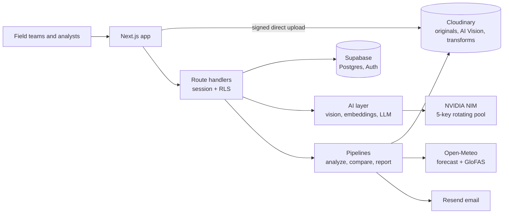

# Impact Atlas

**Field photos in. Proof out.** Atlas organises photos and video, reads them with AI, and turns them into searchable proof, reports and alerts. It is a general evidence-intelligence tool. **Chennai Flood-Watch** is its first *playbook*: the worked example that joins the evidence to live rainfall and river data and tells the officer who must act.

Built for CodeFibonacci x Cloudinary (Problem 02: AI-powered impact and sustainability media platform).

## What you can do

| Screen | What happens |
| --- | --- |
| **Studio** (home) | One screen. Drop a file or pick a sample. Watch Upload, Record, Understand, Organise, Index run for real; your original sits beside what Cloudinary delivers, and metadata appears as each step finishes. |
| **Library** | Smart collections computed from the photos (site, phase, severity, event, AI tags), an **Evidence map** treemap of the whole archive, search by description, multi-select, "Needs review" filter for low-confidence AI results. |
| **Ask** | Plain-language questions over everything. Hybrid retrieval, cited answer, fact-check, and a "How this answer was made" trace. |
| **Compare** | Before/after slider with identical Cloudinary crops. Pairs from different sites are labelled a reference, not a change over time. |
| **Reports** | Designed, printable Markdown reports for *any* selection (evidence report) or for a Chennai site with live risk (flood-risk report). Private share link, email, 1080x1350 story card. |
| **Workflow** | Interactive map of the real pipeline with live counts; toggle the Chennai playbook to see how it plugs in. |
| **Playbooks** | What a playbook defines (sites, what to look for, live data, scoring, recipients), with Chennai live and four templates. |
| **Guide / tour** | First-run spotlight tour, a self-ticking "Get started" checklist, and a public step-by-step guide. |

## The logic (all of it is visible in the UI)

**Retrieval (Ask).** Three retrievers run over the same filtered pool and are merged:
1. **Keywords**: BM25 (Robertson and Zaragoza) over each item's caption, tags, event and site.
2. **Meaning**: a text vector of a *contextualised* description (site, phase, event, date, caption, tags), following Anthropic's [Contextual Retrieval](https://www.anthropic.com/engineering/contextual-retrieval).
3. **Looks like**: a vector of the pixels from the same multimodal model (NVIDIA Llama Nemotron Embed VL), so a text query can match a picture directly.

Ranks are fused with **Reciprocal Rank Fusion**, k=60 ([Cormack, Clarke and Buettcher, SIGIR 2009](https://dl.acm.org/doi/10.1145/1571941.1572114)). Top 12 go to the LLM.

**Grounded planning.** The LLM may propose filters, but a site, phase or severity filter is applied only if the user's own words support it; ignored suggestions are listed. (Found in testing: without this, an invented `site: Adyar River` hid the best photo.)

**Fact-check.** Every number and citation in an answer is traced to the retrieved context, and an LLM judge tests each claim against the photo it cites (in the spirit of [RAGAS](https://arxiv.org/abs/2309.15217) faithfulness). Results stream in after the answer.

**Human in the loop.** Results with AI confidence below 0.6 are flagged "Needs review" until a person confirms or corrects them; each review is logged.

**Risk score.** Six named parts, 100 points: forecast rain in 24 h by IMD class (45), rain probability (10), wet ground (10), river level (15), documented exposure (12), drain and garbage issues (8). Low < 24, moderate < 48, high < 70, severe >= 70. See `lib/risk.ts`.

**Honesty rules.** Before/after only implies change when both photos are the same site. Simulated storms are labelled on every report. Ratings made from a photo's description (AI unavailable) are marked provisional. A separate reranker is not used (NVIDIA's rerank endpoints were unavailable on the build account).

## Architecture

Interactive diagrams generated with [Archify](https://github.com/tt-a1i/archify) are on the public `/architecture` page; the sources are `docs/diagrams/*.json` and the output is `public/diagrams/*.html` (`npm run diagrams` rebuilds them).



## Setup

```bash
npm install
cp .env.example .env         # fill in Supabase, Cloudinary and NVIDIA keys
```

1. **Database.** In the Supabase SQL editor run every file in `supabase/migrations`, in order (`...01` to `...06`). Migration 5 adds the app tables and policies; migration 6 adds the semantic-index columns. Both are idempotent.
2. **Evidence.** `npm run ingest` uploads free, openly licensed Chennai photos from Wikimedia Commons to Cloudinary and writes them to Supabase. (`npm run ingest:db` reruns only the database step from `data/chennai-manifest.json`.)
3. **Run.** `npm run dev`, open the app, press **Try the demo** (needs `DEMO_MODE=true`, `DEMO_EMAIL`, `DEMO_PASSWORD`).
4. **Analyse and index.** On the Studio or Library, analyse pending photos; then build the semantic index (`POST /api/index/backfill`, called in a loop by the UI). Without migration 6 the index lives in memory and Ask says so.

### Providers and fallbacks
* **Image understanding:** Cloudinary AI Vision, then an NVIDIA Nemotron vision model, then rules over the source description (provisional). Order: `VISION_PROVIDERS`. Cloudinary's free AI Vision quota is 100,000 tokens (about 1,300 per photo with the four prompts); the app tracks it and hands over before it runs out.
* **Text LLM:** NVIDIA through a key pool (`NVIDIA_API_KEY_1..N`): least-loaded key first, under `NVIDIA_RPM_PER_KEY` (default 34) per minute, 429 puts a key on cooldown, 401/403 marks it dead, 503 backs off, and retired or slow models are skipped for a while.
* **Email:** Resend if `RESEND_API_KEY` is set; otherwise alerts are logged and a prepared link is shown.

## Project layout

```
app/
  page.tsx               landing (public)
  guide/, architecture/  tutorial and diagrams (public)
  (app)/                 studio, library, ask, compare, reports, workflow, playbooks, assets/[id]
  api/                   assets/analyze, index/backfill, ask (NDJSON), search, reports/*, comparisons, weather
  r/[token]/             private read-only report
components/              studio-client, library-client, ask-client, evidence-map, workflow-map, report-view, landing/*
lib/
  ai/                    nvidia.ts (key pool), vision.ts, llm.ts
  ask.ts, retrieval.ts   planning, hybrid retrieval, RRF, BM25, grounding check
  embeddings.ts          multimodal index (int8-quantised vectors)
  pipeline/, reports/    analyze, compare, evidence + risk reports
  cloudinary/            signing and delivery URLs
  weather/, risk.ts, collections.ts, notify/
docs/diagrams/           Archify sources
supabase/migrations/     SQL
scripts/                 ingest-commons.mjs, build-diagrams.mjs
```

## Data notes
* Photos are from Wikimedia Commons under open licences; credit, licence and source link are stored and shown on every image.
* Many flood photos have no recorded location, so they are **city-wide evidence**, never guessed onto a site.
* Rain and river values are live from Open-Meteo. Seed contacts use `example.org`; replace them before sending anything real.
* `DEMO_MODE` must be off in production.
